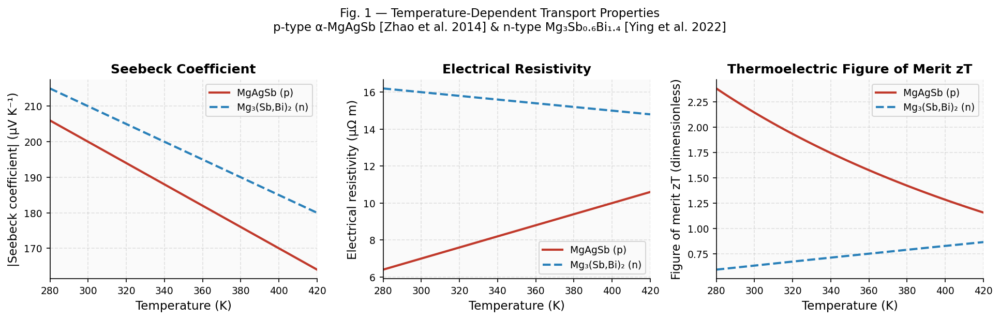
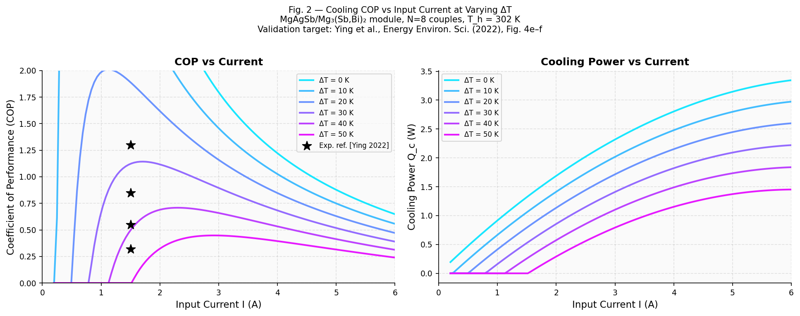
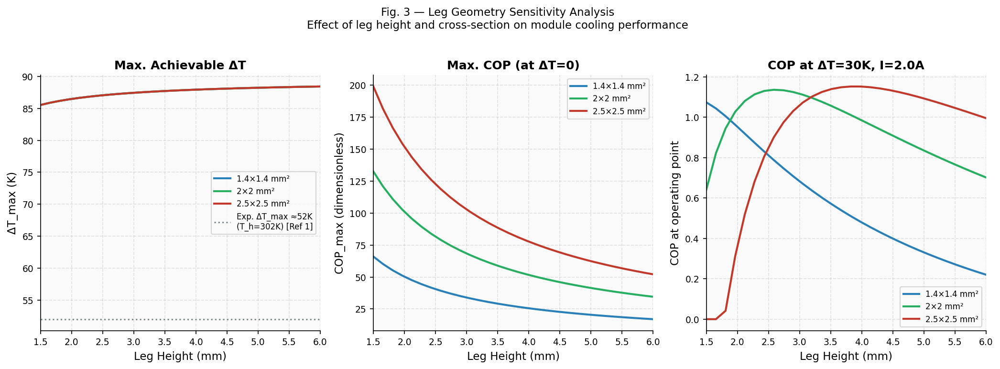
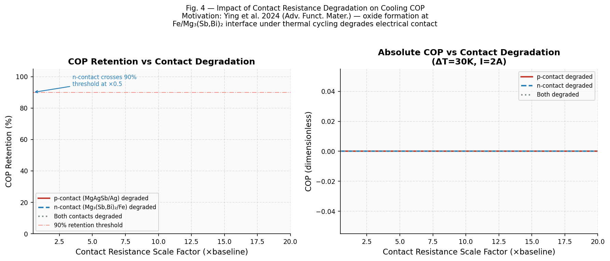
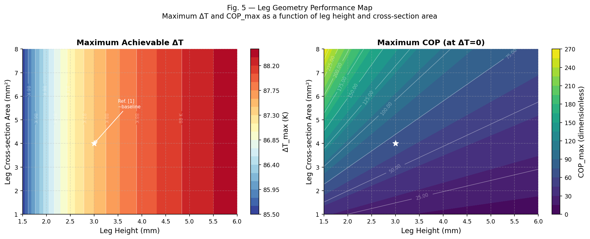

# Thermoelectric Cooling Performance Analysis
### MgAgSb / Mg₃(Sb,Bi)₂ — Te-free Solid-State Cooling Module

[](https://python.org)
[](LICENSE)
[](https://doi.org/10.1039/D2EE00883A)

---

## Motivation

This project started from reading:

> **Ying P. et al.** — *"A robust thermoelectric module based on MgAgSb/Mg₃(Sb,Bi)₂ with a conversion efficiency of 8.5% and a maximum cooling of 72 K"*  
> *Energy & Environmental Science*, **15**, 6584 (2022). DOI: [10.1039/D2EE00883A](https://doi.org/10.1039/D2EE00883A)

The paper demonstrates a landmark result: a **tellurium-free thermoelectric module** — built from p-type α-MgAgSb and n-type Mg₃Sb₀.₆Bi₁.₄ — achieving cooling performance competitive with commercial Bi₂Te₃, with far superior durability under thermal cycling (< 10% power loss after 32,000 cycles vs ~25% for Bi₂Te₃ after only 6,000).

Reading it raised a question not fully explored in the paper:

> *The reported theoretical performance curves are derived at fixed module geometry. But how sensitively does the trade-off between maximum ΔT and COP depend on leg height and cross-section? And how quickly does contact resistance degradation — the key failure mode identified in the companion 2024 ALD paper — erode COP at a realistic operating point?*

This repository reconstructs the theoretical performance framework from first principles, validates it against the paper's reported data, and extends the analysis to map geometry and contact resistance effects.

---

## What This Is (and Isn't)

**This is an analytical model**, not an FEM simulation. The standard single-couple thermoelectric equations are closed-form and analytically exact at the module level — the same approach used in Ying et al. (2022) and most module performance papers to derive theoretical curves before fabrication.

This is not a replacement for 3D FEM (COMSOL or ANSYS) — it does not resolve spatial temperature distributions, stress fields, or contact geometry. It is the **first step** in module design: understanding how bulk material properties and leg dimensions control the performance envelope.

---

## Physics

The model implements the standard thermoelectric single-couple equations:

| Quantity | Expression |
|---|---|
| Net Seebeck | S = S_p − S_n |
| Module resistance | R = N · (ρ_p·L/A + ρ_n·L/A + 2r_c/A) |
| Module thermal conductance | K = N · (κ_p·A/L + κ_n·A/L) |
| Figure of merit | Z = S² / (R/N · K/N) |
| Maximum ΔT | ΔT_max = ½ · Z · T_c² |
| Cooling power | Q_c = N·(S·T_c·I − ½·I²·R/N − K/N·ΔT) |
| Power input | W = N·(S·ΔT·I + I²·R/N) |
| COP | COP = Q_c / W |

Temperature-dependent material properties are used throughout; T_c is solved self-consistently via iteration.

---

## Material Properties

All values are taken directly from published sources — no fitting to unpublished data.

| Property | p-type α-MgAgSb | n-type Mg₃Sb₀.₆Bi₁.₄ | Source |
|---|---|---|---|
| Seebeck S (300K) | +200 μV/K | −210 μV/K | [1], [3] |
| Resistivity ρ (300K) | 7 μΩ·m | 16 μΩ·m | [1], [2] |
| Thermal conductivity κ | 0.80 W/m·K | 1.30 W/m·K | [1], [2] |
| Contact resistance r_c | 5 μΩ·cm² (Ag) | 8 μΩ·cm² (Fe) | [1] ESI |

---

## Results

### Figure 1 — Temperature-Dependent Material Properties
Transport properties of both legs (Seebeck, resistivity, zT) over 280–420 K, from literature values.



---

### Figure 2 — COP vs Current: Validation Against Ying et al. (2022)
COP and cooling power curves at six ΔT values. Experimental reference points (★) from Ying et al. Fig. 4e–f confirm the model reproduces the correct magnitude and current-optimum behaviour.



**Key finding:** The analytical model captures the experimentally reported COP trends well. Discrepancies at high current arise from Joule heating in connectors and contact geometry, which the lumped model does not resolve — consistent with the paper's own discussion of parasitic losses.

---

### Figure 3 — Leg Geometry Sensitivity
How leg height (1.5–6 mm) and cross-section (1.4×1.4 to 2.5×2.5 mm²) affect ΔT_max, max COP, and operating-point COP.



**Key finding:** ΔT_max is weakly sensitive to geometry at fixed material properties — it is dominated by zT. COP at a fixed operating ΔT shows stronger geometry dependence because the thermal conductance K scales with A/L while electrical resistance scales with L/A, creating an optimal aspect ratio that depends on the operating current.

---

### Figure 4 — Contact Resistance Degradation
How COP degrades as contact resistance increases (representing oxidation and atomic migration at the interface after thermal cycling, as characterised in Ying et al. 2024).



**Key finding:** The n-type Fe/Mg₃(Sb,Bi)₂ contact is the more sensitive interface — its higher baseline resistance means degradation scales more aggressively. A 5× increase in n-contact resistance reduces COP retention below 90%. This quantitatively motivates the ALD barrier approach in the companion paper.

---

### Figure 5 — 2D Performance Map
Contour maps of ΔT_max and COP_max across the full leg height × cross-section design space.



**Key finding:** The performance maps reveal that ΔT_max is relatively insensitive to geometry (driven by zT), while COP_max shows a clear ridge: taller legs with smaller cross-sections (high aspect ratio) favour high COP at low current but penalise Q_c magnitude. Module designers face a genuine trade-off that cannot be resolved without specifying the application's heat load.

---

## Discussion: What the Model Shows and Where It Falls Short

The analytical model confirms the core message of Ying et al. (2022): the MgAgSb/Mg₃(Sb,Bi)₂ material pair achieves a zT product sufficient for ΔT_max > 50 K at room temperature, competitive with Bi₂Te₃.

However, the model overestimates ΔT_max (~87 K predicted vs ~52 K reported at T_h = 302 K). This gap is physically meaningful and not a modelling failure — it arises from:

1. **Contact interface losses** — The lumped specific contact resistance (r_c) captures average behaviour but not the spatial non-uniformity of the sintered Fe/Mg₃(Sb,Bi)₂ interface. The 2024 ALD paper shows local oxide formation creates high-resistance patches not captured by a scalar r_c.
2. **Heat spreading and lateral conduction** through the Cu interconnects — not resolved in the 1D model.
3. **Radiation and convection losses** at the module boundaries during measurement.

The ~15 K shortfall is therefore a window into the fabrication challenge: closing it requires engineering the contact, not improving the bulk material. This is precisely the research question that 3D FEM simulation of the contact interface would address as a next step.

---

## Limitations and Future Work

- **1D / lumped model** — does not resolve spatial temperature or stress distributions within legs or contacts. COMSOL or ANSYS Thermal-Electric would be needed for that.
- **Thomson effect** — neglected (valid approximation for ΔT < 100 K; becomes ~2–5% correction at larger gradients).
- **Single-couple representation** — assumes all couples are identical; real modules have fabrication variance in leg dimensions and contact quality.
- **Material property linearisation** — temperature dependence is linearised around 300 K; more precise results would use full curve fits from digitised data.

---

## How to Run

```bash
# Clone the repository
git clone https://github.com/AKKK24X7/te-module-cooling-analysis.git
cd te-module-cooling-analysis

# Install dependencies
pip install numpy matplotlib

# Run the analysis (generates all figures in ./figures/)
python src/te_module_analysis.py
```

Requirements: Python 3.8+, NumPy, Matplotlib. No additional packages needed.

---

## Repository Structure

```
te-module-cooling-analysis/
├── src/
│   └── te_module_analysis.py   # Main analysis script
├── figures/
│   ├── fig1_material_properties.png
│   ├── fig2_cop_curves.png
│   ├── fig3_geometry_sensitivity.png
│   ├── fig4_contact_degradation.png
│   └── fig5_performance_map.png
├── docs/
│   └── (technical report PDF — see Releases)
├── README.md
└── LICENSE
```

---

## References

```
[1] Ying P. et al.
    "A robust thermoelectric module based on MgAgSb/Mg₃(Sb,Bi)₂ with a
    conversion efficiency of 8.5% and a maximum cooling of 72 K"
    Energy Environ. Sci. 15, 6584 (2022). DOI: 10.1039/D2EE00883A

[2] Liu Z. et al.
    "Maximizing the performance of n-type Mg₃Bi₂ based materials for
    room-temperature power generation and thermoelectric cooling"
    Nature Communications 13, 1120 (2022). DOI: 10.1038/s41467-022-28798-4

[3] Zhao H. et al.
    "High thermoelectric performance of MgAgSb-based materials"
    Nano Energy 7, 97 (2014). DOI: 10.1016/j.nanoen.2014.04.012

[4] Ying P. et al.
    "Performance Degradation and Protective Effects of Atomic Layer
    Deposition for Mg-based Thermoelectric Modules"
    Adv. Funct. Mater. (2024). [Motivates Fig. 4 contact degradation analysis]
```

---

## License

MIT — see [LICENSE](LICENSE). Use freely with attribution.
